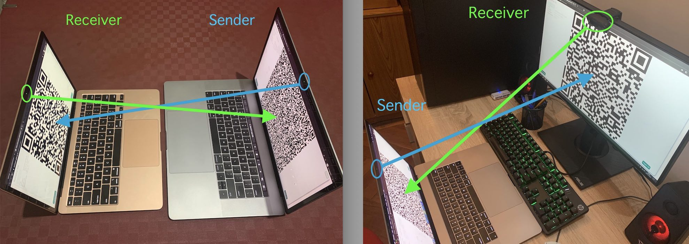

# QRFileTransfer
This tool allows you to transmit files between two devices relying <b>EXCLUSIVELY</b> on the Camera stream combined with QR image encoding/decoding. Therefore the two devices can work both offline, regardless of the platform and the hardware configuration, as long as both have a working camera. 
                <b>Preconiditions:</b>
                <ul>
                    <li>Sender and Receiver devices have the camera access</li>
                    <li>The two devices are one in front of each other, so that both the camera points to the other screen</li>
                </ul>
                <b>Reccomendations:</b>
                <ul>
                    <li>The distance between them is the shortest possible</li>
                    <li>The two devices are fixed while the transmission is ongoning</li>
                    <li>Make sure the QR images on both Sender and Receiver are <b>fully</b> visible. So, toggle off the camera view if displaed, and make sure no window covers the web page while the process is going. In case this happens, the process will pause until the next valid QR image will be detected.</li>
                    <li>Try to maintain the camera light the same while the process is going, to preserve the quality of the camera stream and simplify the work of QR images detection</li>
                    <li>The bigger is the size of the chunk, the smaller will be the "squares" drawn within the QR image and harder will be for the camera to detect the QR images from the camera feed. On the other hand, if the camera quality is higher than average (eg. Full HD) then the resulting resolution should make the recognization on bigger chunks possible.</li>
                </ul>
                <b>How to use:</b> 
                <ul>
                    <li>The Receiver device starts the session from "Receive file"</li>
                    <li>The Receiver device presses on "Start receiving" and allows the camera permission asked by the browser</li>
                    <li>The Sender device starts the session from "Send file" and picks the file which is intended to be transmitted to the Receiver device</li>
                    <li>The Sender device can change the chunk size if needed or just press directly on "Start sending" </li>
                    <li>The Sender device allows the camera permission asked by the browser</li>
                    <li>For both Sender and Receiver, you can click on "Toggle Camera" to hide/show the camera view, or click on "Toggle QR" to show the QR full screen (recommended) or not</li>
                </ul>
                <b>How does it work:</b> 
                <ul>
                    <li>The first QR image displayed by the Sender is providing the meta info so that the Receiver can detect it and configure itself, and start receiving the actual file chunks. Those meta info are file name, file size, number of chunks, chunk size, etc</li>
                    <li>The Receiver replies displaying a QR image to notify the Sender to start displaying the QR image chunks</li>
                    <li>The Sender starts displaying the QR Image for each file chunk</li>
                    <li>For each QR Image recognized by the Receiver's camera, if this is a file chunk QR image, it will "reply" to the Sender by displaying another QR image with the hash (SHA-256) of the decoded file chunk.</li>
                    <li>The Sender will detect the hash displayed by the Receiver and, if it matches with the expected hash value, it will proceed with the next chunk. If not, it will display a new QR image to the Receiver, providing the info that the last chunk was not valid and carrying over again the pending chunk to be detected and revalidated again (in this case the Receiver will drop the pending chunk in order to decode it again) </li>
                    <li>When the last chunk is received on the Receiver and then validated back on the Sender, then a last QR image is sent notifying the Receiver that the transmission is completed.</li>
                    <li>At this stage, the Receiver merges the collected chunks in a single Blob object and downloads it on the device's disk</li>
                </ul>
                <b>Dependencies:</b> 
                <ul>
                    <li>This tool is written using Vanilla Javascript, HTML and CSS, using the below  3rd-party libraries for QR encoding/decoding</li>
                    <li><a href="https://github.com/nayuki/QR-Code-generator">QR-Code-generator</a> for QR encoding</li>
                    <li><a href="https://github.com/cozmo/jsQR">jsQR</a> for QR decoding</li>
                </ul>
                <b>Samples:</b> 
                
